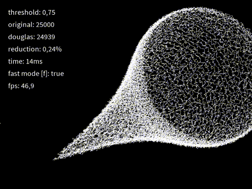
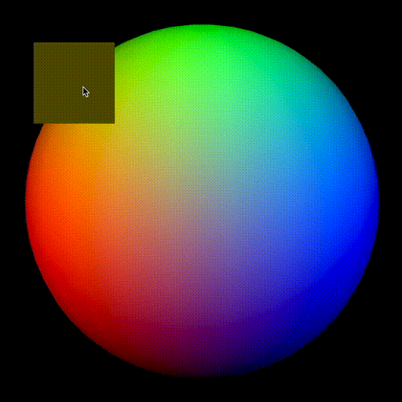
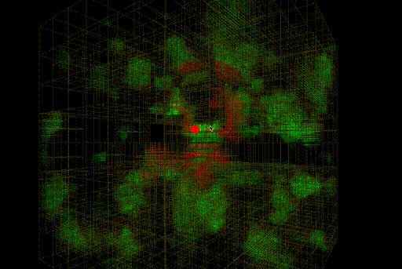
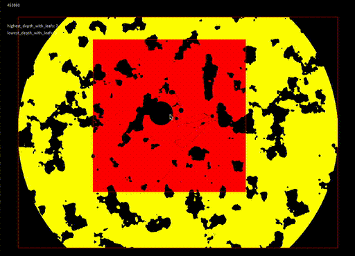
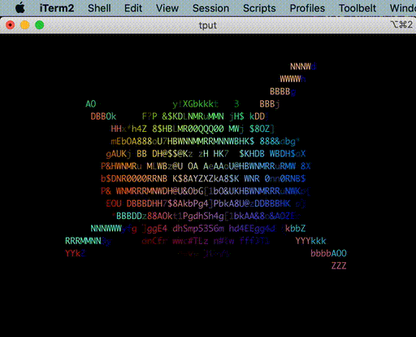
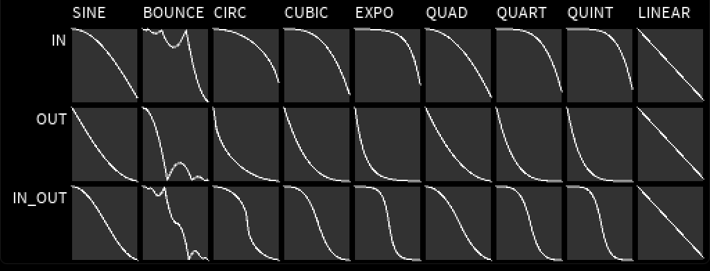

[SFJL_Java_Tokenizer]:  src/sfjl/SFJL_Java_Tokenizer.java
[SFJL_Quad_Tree]:       src/sfjl/SFJL_Quad_Tree.java
[SFJL_Octree]:          src/sfjl/SFJL_Octree.java
[SFJL_Math]:            src/sfjl/SFJL_Math.java
[SFJL_Terminal_IO]:     src/sfjl/SFJL_Terminal_IO.java
[SFJL_Tween]:           src/sfjl/SFJL_Tween.java
[SFJL_Douglas_Peucker]: src/sfjl/SFJL_Douglas_Peucker.java
[SFJL_Print]:           src/sfjl/SFJL_Print.java
[SFJL_FNV_Hash]:        src/sfjl/SFJL_FNV_Hash.java
[SFJL_Base64]:          src/sfjl/SFJL_Base64.java
[SFJL_Doeke]:           src/sfjl/SFJL_Doeke.java
[SFJL_Spatial_Map]:     src/sfjl/SFJL_Spatial_Map.java
[SFJL_Intergral_Image]: src/sfjl/SFJL_Intergral_Image.java
[SFJL_Blobscanner]:     src/sfjl/SFJL_Blobscanner.java
[SFJL_K_D_Tree]:        src/sfjl/SFJL_K_D_Tree.java

[SFJL_Java_Tokenizer_Ex]:  src/sfjl_examples/SFJL_Java_Tokenizer_Example.java
[SFJL_Quad_Tree_Ex]:       src/sfjl_examples/SFJL_Quad_Tree_Example.java
[SFJL_Octree_Ex]:          src/sfjl_examples/SFJL_Octree_Example.java
[SFJL_Math_Ex]:            src/sfjl_examples/SFJL_Math_Example.java
[SFJL_Terminal_IO_Ex]:     src/sfjl_examples/SFJL_Terminal_IO_Example.java
[SFJL_Tween_Ex]:           src/sfjl_examples/SFJL_Tween_Example.java
[SFJL_Douglas_Peucker_Ex]: src/sfjl_examples/SFJL_Douglas_Peucker_Example.java
[SFJL_Print_Ex]:           src/sfjl_examples/SFJL_Print_Example.java
[SFJL_FNV_Hash_Ex]:        src/sfjl_examples/SFJL_FNV_Hash_Example.java
[SFJL_Base64_Ex]:          src/sfjl_examples/SFJL_Base64_Example.java
[SFJL_Doeke_Ex]:           src/sfjl_examples/SFJL_Doeke_Example.java
[SFJL_Spatial_Map_Ex]:     src/sfjl_examples/SFJL_Spatial_Map_Example.java
[SFJL_Intergral_Image_Ex]: src/sfjl_examples/SFJL_Intergral_Image_Example.java
[SFJL_Blobscanner_Ex_1]:   src/sfjl_examples/SFJL_Blobscanner_Example_Heightmap.java
[SFJL_Blobscanner_Ex_2]:   src/sfjl_examples/SFJL_Blobscanner_Example_Heightmap_Mask.java
[SFJL_Blobscanner_Ex_3]:   src/sfjl_examples/SFJL_Blobscanner_Example.java
[SFJL_K_D_Tree_Ex]:        src/sfjl_examples/SFJL_K_D_Tree_Example.java

# SFJL
Collection of single-file java libraries with minimal to no dependencies, inspired by the [stb](https://github.com/nothings/stb) libraries.

Too quote [Sean Barrett](http://nothings.org/) on his philosophy of the stb libraries:

> Philosophy
>
> stb libraries are designed with the following priorities:
>
>    1. easy to use
>    2. easy to maintain
>    3. good performance
>
> Sometimes I let "good performance" creep up in priority over "easy to maintain", and for best performance I may provide less-easy-to-use APIs that give higher performance, in addition to the easy-to-use ones. Nevertheless, it's important to keep in mind that from the standpoint of you, a client of this library, all you care about is #1 and #3, and stb libraries DO NOT emphasize #3 above all. 
>
>  Some secondary priorities arise directly from the first two, some of which provide more explicit reasons why performance can't be emphasized.
>
>    - Portable ("ease of use")
>    - Small source code footprint ("easy to maintain")
>    - No dependencies ("ease of use")

I feel very aligned with this philosophy, hence the quote. I do however have a huge dependency on [processing](www.processing.org) when it comes to the examples. But this goes back to the *easy to use* priority. This also means the libraries are centered around using floats instead of doubles and the order of color is assumed to be argb. Also it will be centered around using the latest version of processing with no backwards compatibility.

# Libraries

| library                                          | latest version | category           | LoC: | description                                       |
| ------------------------------------------------ | -------------- | ------------------ | ---- | ------------------------------------------------- |
| **[SFJL_Math][SFJL_Math]**                       | v0.56          | math               | 589  | the math I keep reusing                           |
| **[SFJL_Print][SFJL_Print]**                     | v0.51          | utility            | 180  | print and println without the need of System.out  |
| **[SFJL_Base64][SFJL_Base64]**                   | v0.51          | utility            | 136  | base64 encoder and decoder functions              |
| **[SFJL_FNV_Hash][SFJL_FNV_Hash]**               | v0.52          | utility            | 148  | [FNV hash][fnv_link] implementation               |
| **[SFJL_Tween][SFJL_Tween]**                     | v0.51          | graphics / utility | 226  | tween functions                                   |
| **[SFJL_Douglas_Peucker][SFJL_Douglas_Peucker]** | v0.50          | graphics / utility | 179  | line based curve decimator for 2d and 3d          |
| **[SFJL_Quad_Tree][SFJL_Quad_Tree]**             | v0.53          | graphics / utility | 885  | fast quad_tree implementation, with lots of optimized functions to get points |
| **[SFJL_Octree][SFJL_Octree]**                   | v0.50          | graphics / utility | 1126  | fast octree implementation, with lots of optimized functions to get points |
| **[SFJL_K_D_Tree][SFJL_K_D_Tree]**               | v0.50          | graphics / utility | 108  | minimal k-d tree implementation lacking a lot of functionality |
| **[SFJL_Intergral_Image][SFJL_Intergral_Image]** | v0.52          | graphics / utility | 149   | simple intergral image |
| **[SFJL_Terminal_IO][SFJL_Terminal_IO]**         | v0.50          | graphics / utility | 246  | (hacky!) functions for getting things like rows, columns, key pressed, and functions for setting the cursor, the color and more |
| **[SFJL_Blobscanner][SFJL_Blobscanner]**         | v0.50          | graphics / utility | 304  | Contour scanner based on a threshold |
| **[SFJL_Doeke][SFJL_Doeke]**                     | v0.53          | misc               | 92   | collection of functions that do not need their own file, mostly snippets I use in multiple files                                |
|                                                  |                | **sum**            | 4260 |                                                                                                                                 |

[fnv_link]: http://www.isthe.com/chongo/tech/comp/fnv/

## Dependencies

Most of the examples use [processing](www.processing.org) as a dependency, which is included in this repository.
At this time no other libraries are being used.

<!-- > &#x26A0; All the dependencies required are included in this repository -->

# Screenshots

> &#x26A0; Not every example is suited for a screenshot!

**[SFJL_Blobscanner_Example_Heightmap][SFJL_Blobscanner_Ex_1]** 

**[SFJL_Blobscanner_Example_Heightmap_Mask][SFJL_Blobscanner_Ex_2]** 

**[SFJL_Douglas_Peucker_Example][SFJL_Douglas_Peucker_Ex]** 

**[SFJL_Intergral_Image_Example][SFJL_Intergral_Image_Ex]** 

**[SFJL_Octree_Example][SFJL_Octree_Ex]** 

**[SFJL_Quad_Tree_Example][SFJL_Quad_Tree_Ex]** 

**[SFJL_Terminal_IO_Example][SFJL_Terminal_IO_Ex]** 

**[SFJL_Tween_Example][SFJL_Tween_Ex]** 

# Never Asked FAQ
#### Any advice of how to write single-file libraries for java?
Yes, [How I write single-file java libraries](how-to/README.md)

#### Are there other single-file java libraries with public-domain/open source libraries with minimal dependencies out there?
I can't find them, if you know any please let me know. I would love to list them.

#### Where are the build files to generate the jar files?
I have a strong dislike towards build systems like maven and gradle. I used shell scripts before to make the jar files, but those are neither human friendly, and do not work on windows. I think it is a shortcoming of java to not provide an easy way to create jar files from java itself. Right now I use VSCode with the [vscode-java-dependency ](https://github.com/Microsoft/vscode-java-dependency) extension, which has shortcomings as well (microsoft seems to be incompetent), but is so far the best option provided. Also in certain cases I think it is better to copy the libraries and include them as source files instead of compiled jar's.

# Libraries / Projects making use of SFJL libraries:
Biased mentioning alert since I made this;
[java_preproc_macros](https://github.com/clankill3r/java_preproc_macros) a almost single file library to replicate C macros like `__LINE__` with bytecode manipulation. I did not make this into a SFJL_Preproc_Macros cause it's a java agent, and therefor does not fall in the easy to use category. 

<!-- TODO add p5_terminal_graphics -->

 

*Special thanks to [Sean Barrett](http://nothings.org/) for being a huge inspiration for this project*

