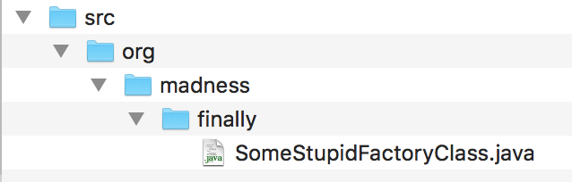
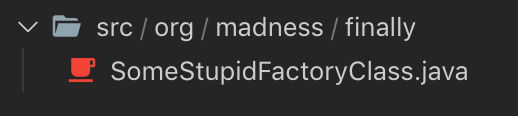
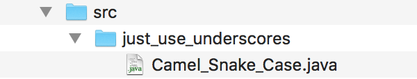
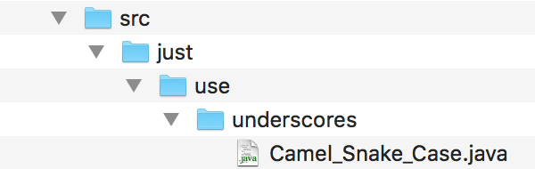
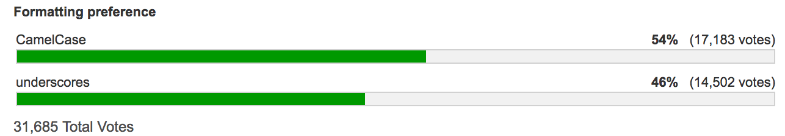

<br>

**Table of Contents**

- [How I write single-file java libraries](#how-i-write-single-file-java-libraries)
  - [Some Java frustrations](#some-java-frustrations)
- [How I write them, part II](#how-i-write-them-part-ii)
  - [Breaking it up](#breaking-it-up)
    - [package name](#package-name)
    - [class declaration](#class-declaration)
    - [list out the data](#list-out-the-data)
    - [static static static!](#static-static-static)
    - [dealing with access](#dealing-with-access)
    - [constructor alternative](#constructor-alternative)
    - [functions instead of methods](#functions-instead-of-methods)
    - [using a single-file library](#using-a-single-file-library)
  - [Syntax](#syntax)
    - [CamelCase vs snake_case](#camelcase-vs-snake_case)
    - [`static public` vs `public static` order](#static-public-vs-public-static-order)

---

# How I write single-file java libraries

The way I write single-file java libraries and java in general goes against almost every java convention. I have lived by the java conventions for years cause I thought they where important. Over time I learned java is not that good of a language (like most languages unfortunately). I will only point out reasons that have a relation to how I write single-file libraries. If I would list all frustrations then this doucment would become an infinite scroll page.

---
## Some Java frustrations

- Every class should live in it's own file. This is terrible, for one, the human brain is really limited. We are way better in understanding things we can read from top to bottom. With every class in it's own file there is way more digging around in files to get a understanding of what is going on. Sure a top-to-bottom aproach is never really possible when dealing with code, but it can be attempted.

- The folder structure represent the package name. This is not a huge frustration cause the time dealing with this is minor. Also it is understandable from the perspective of avoiding naming conflicts, but why not use namespaces like in *C++*. The problem also does not lies in the java file for me but on the hard disk it self.
The code itself is too many levels deep in the folder structure.

    

    It adds a lot of navigation steps when using *Finder* or *Windows Explorer* or any other file browser. And it is a waste of vertical space.

    Compliments to VSCode:

    

- Java is suffering from the OOP paradigm. This is a big topic and would take me several alineas to attack correctly. To keep it really short, the main purpose of a computer is to manipulate data, so any program should be centered around that purpose. OOP does not do that since it is about **Programming Oriented around Objects**, hence the name OOP. It is a nice concept in theory but not so in practise, it does not scale well with increasing complexity of projects, instead it is a way of putting up walls. OOP is harder to read, debug and maintain. Wen I say OOP I don' mean so much about methods living inside a class, but more about subjects like inheritance and using `super`.

- Access modifiers are terrible. To many times I have needed access to a field that was private or protected. Now in order to do this you have to use reflection, this adds a lot of friction by the amount of lines required to acces a field. It's a waste of CPU cycles, and worse of all now your program relies on a string to retrieve the data. So instead of using:

    ```java
    foo.x = 10;
    ```

    Now to change the value of `x`:

    ```java
    try {
        Field x_field = Foo.class.getDeclaredField("x");
        x_field.setAccessible(true);
        x_field.set(foo, 666);
    } catch (NoSuchFieldException | SecurityException | IllegalArgumentException | IllegalAccessException e) {
        e.printStackTrace();
    }
    ```

    Can it be worse? Yes it can!

    Let's say the creator of `foo.x` decides to rename `x` to `x_pos`, since your own program still relies on the string `"x"` it will compile perfectly fine. And the benefits of a having a staticly typed language are out the window. You will get a `NoSuchFieldException` at runtime, that is if you hit it. It might be a low probabilty case that does not trigger when you test.

    Personally I think java should have gone with a syntax like this (that is if they really want to go for restricted access options (which they do)):

    `foo.(private)x = 10;`

    Where there is a compile time error when the access cast does not match the actual access modifier. But suggestions to make Java better is like having suggestions to prevent WWII.

---
# How I write them, part II

> **⚠** How I write them is an ongoing process, but I feel like I'm close to where I finally will end of how I write them.

>**⚠** On large projects I still use multiple files, but each individual file follows the style of how I write a single file library.

>**⚠** To almost everything I explain below I will have exceptions in certain cases. For clarity of the document I won't point out most of those exceptions. Just remember that this document is meant as a guideline and not as rules written in stone.

I will first show an example, then the usage of it, and after that I will break it down for further explanation.

---
**The single-file library:**

```java
package just_use_underscores;

public class Camel_Snake_Case {
    
    private Camel_Snake_Case(){}


static public class Foo { 
    public String ;
    public float y;
}

static public class Bar { 
    public float x;
    public float y;
    public Foo _meant_to_be_private;
}

static public class Vec2 { 
    public float x;
    public float y;
    public Vec2(float x, float y) {this.x = x; this.y = y;}
}

static public Foo make_foo(float x, float y) {
    Foo f = new Foo();
    f.x = x;
    f.y = y;
    return f;
}

static public Foo make_bar(float x, float y) {
    Bar b = new Bar();
    b.x = x;
    b.y = y;
    return b;
}

static public void bananas(Foo f, Bar b) {
    // ..
}

}
```

**Using the library:**

```java
package just_use_underscores_example;

import static just_use_underscores.Camel_Snake_Case.*;

public class How_To_Use_Example {

    public static void main(String[] args) {
        Foo f = make_foo(1, 3);
        Bar b = make_bar(3, 5);
        foo_bar(f, b);
    }

}
```

---
## Breaking it up

---
### package name

```java
package just_use_underscores;
```

Results in:



compared to:

```java
package just.use.underscores;
```




<br>

> **⚠** I still have nested folders inside the `src` directory, but I keep the depth to a reasonable minimum.

---
### class declaration

```java
public class Camel_Snake_Case {
    
    private Camel_Snake_Case(){}
```

The class that is matching the filename just works as a container to hold all the other inner classes. There should **never** be an instance created of this class. Therefor the `private` acces modifier is used for the constructor. This is one of the few times I use anything other then `public`.

> **⚠** After the constructor, everything in the file has one indentation less then usual. I like to keep the code close to the left border of the editor. It **slighly** adds to the clariness when scrolling threw the file. Also I "win" 4 spaces of space, which in some cases are very welcome.

---
### list out the data

Next I layout all data, inspired by `struct`'s of `C`:

```java
static public class Foo { 
    public float x;
    public float y;
}

static public class Bar { 
    public float x;
    public float y;
    public Foo _meant_to_be_private;
}

static public class Vec2 { 
    public float x;
    public float y;
    public Vec2(float x, float y) {this.x = x; this.y = y;}
}
```

The main goal here is density of the data, that is in vertical editor space. Reading those classes often already gives an insight in what the program does and how it is structured. If there are no circulair dependencies, then I declare in top-to-bottom order. So i class `B` is using class `A` then I prefer to declare class `A` first.
About *>95%* of the time I don't have constructors. Sometimes I add a single-line private constructor to prevent the user of creating an instance using the `new` keyword. In the above example I do have a single-line `public` constructor for `Vec2`.

---
### static static static!

Note that all the classes are `static`, without this we need to use `Camel_Snake_Case.new Foo(..)` which is a syntax I don't like. The whole single-file idea revolves around using `static`. 

---
### dealing with access 

If a field is meant to be `private` then I prefix this with a `_`, see `_meant_to_be_private` in the `Bar` class. I use this really rarely, thinking about protection levels is brainpower spent that could have be used for something else.

---
### constructor alternative

I just make simple functions that are prefixed with "*make_*". One other adventage is that now `null` can be returned. Where using a constructor always yields in an instance.

```java
static public Foo make_foo(float x, float y) {
    Foo f = new Foo();
    f.x = x;
    f.y = y;
    return f;
}
```
---
### functions instead of methods

Instead of having a `bananas` method inside `Foo` and/or `Bar` I create static functions that will take the parameters required.

```java
static public void bananas(Foo f, Bar b) {
    // ..
}
```
This greatly simplifies things in the mind, I have been amazed by this many times.

Let's say if we did this the old way, would you then call `foo.bananas(bar)` or `bar.bananas(foo)`? And if we add another class `Ham` that also has a `bananas`...

Another huge plus is that it reduces the risk of creating bugs. To give an example:

Let's say you went for the OOP way and both `Bar` and `Foo` have `craziness(float x)` method and you want to call that method from inside `Foo` like this:
```java
bar.craziness(1.23f);
```
But you accidently typed this:
```java
craziness(1.23f);
```
Since the method `craziness` exists inside `Foo` you compile perfectly fine, but now you have a bug that can be really hard to detect! Specially if you don't crash but get undefined behaviour.

---
### using a single-file library

There is not much to it, it does make life easy to import them static.
```java
import static just_use_underscores.Camel_Snake_Case.*;
```
This allows for ommiting the containing class name so you can make calls like `bananas(..)` instead of `Camel_Snake_Case.bananas(..)`. In certain cases a "normal" import and using the class name prefix can be better for clarity.

> **⚠** Sometimes when there are name conflicts you have to do a "normal" import aswell and make calls like `Camel_Snake_Case.bananas(..)`.

---
## Syntax

The scope of this article is not on syntax, however I still wanted to give it some brief attention.

---
### CamelCase vs snake_case 

I prefer snake_case over CamelCase cause it gives more breathing room, for class names I use Camel_Snake_Case. I was suprised most people prefer CamelCase over snake_case.

> 

https://poll.fm/4528769/

I was more suprised by some of the recuring arguments I see online, e.g. that CamelCase is easier to type. First off all, the time we spend reading code is magnitudes larger then the time spend on writing code. Also unless your on a mobile phone, I don't see how `_` is hard to type.

Here is some scientific research from 2009 where to my suprise CamelCase won in readability.

[To CamelCase or Under_score](http://citeseerx.ist.psu.edu/viewdoc/download?doi=10.1.1.158.9499&rep=rep1&type=pdf)

And here is a scientific research from 2010 using an eye tracker where snake_case came out better.

[An Eye Tracking Study on camelCase and under_score Identifier Styles](http://www.cs.kent.edu/~jmaletic/papers/ICPC2010-CamelCaseUnderScoreClouds.pdf)

Anyway, in the end it comes down to a personal liking, or the conventions you have to follow by the company you work for.

---
### `static public` vs `public static` order

By convention the order is `public static`, but I'm more interested if something is `static` or not. Same goes for `final`, in general I put `public` at the end.
Except in classes cause I like when things align neatly e.g.:

```java
public final boolean debug;
public UI_State state = new UI_State(true);
public UI_State prev_state = new UI_State(false);
public UI_Builder ui_builder = new UI_Builder();
public Element_Node root_node = make_element_node(null, "hidden_root", -1);
public transient Comparator<Element> draw_buffer_comparator;
```
